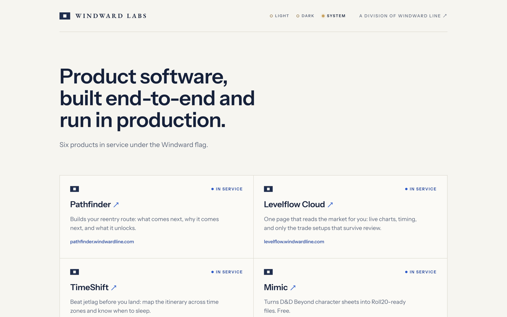

# labs.windwardline.com

Windward Labs, the software division of Windward Line. Five products in
service: [Pathfinder](https://pathfinder.windwardline.com),
[Levelflow Cloud](https://levelflow.windwardline.com),
[Mimic](https://mimic.windwardline.com),
[That's Extra](https://thats-extra.windwardline.com), and
[Proper Form](https://proper-form.windwardline.com).

The register stays current by standing rule: when new work goes live, its
row joins this page, the portfolio follows, and both READMEs update in the
same change.

Static site, no build step: two HTML pages (the register and `/schedule`,
which embeds the division's Koalendar booking page), one stylesheet,
self-hosted Instrument Sans and EB Garamond, the division signal flag as
inline SVG, and the lamp (light / dark / system) for theme control. Design
spec: [docs/superpowers/specs/2026-07-25-labs-slipway-design.md](docs/superpowers/specs/2026-07-25-labs-slipway-design.md).

Deployed on Vercel; DNS on Cloudflare. Pushes to `main` deploy to production.
Security headers are set in [vercel.json](vercel.json).

The site is proprietary; see [LICENSE](LICENSE). The webfonts are not.
EB Garamond and Instrument Sans ship under the SIL Open Font License 1.1.
Their copyright notices and the license text are in
[fonts/OFL.txt](fonts/OFL.txt).
